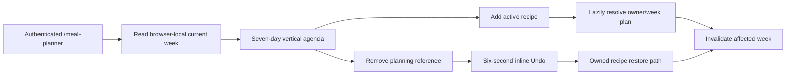

# Add current-week meal planning

## Why

The database and local-calendar contract were ready, but users still needed the first useful planner screen: a quick way to place saved recipes into the current week and reverse an accidental removal without navigating through a calendar grid or a full recipe library.

## What changed

- Added an authenticated `/meal-planner` route and a Meal Planner destination in the existing More sheet.
- Implemented the approved compact date strip and seven-section vertical agenda from `docs/assets/meal-planner-mockups.svg`.
- Kept empty-week reads free of writes and lazily resolved one owner/week plan on the first valid add.
- Added one cached active-recipe options request with local title-or-ingredient filtering and no image lookup.
- Added a compact, accessible add-meal sheet using native recipe, meal-slot, and servings controls.
- Defaulted a selected recipe's planned servings and its sole meal type; otherwise the planner uses Anytime.
- Added direct per-entry removal and one latest-only inline Undo that expires after six seconds. Its dedicated restore contract shares the validated insert path while permitting an owned archived recipe to be recovered.
- Paused Undo expiry during a restore request, kept failed restores retryable, and added an in-sheet retry for recipe-option loading failures.
- Added safe duplicate, validation, loading, empty, error, pending, and archived-entry presentation behavior.
- Kept week navigation, editing, copy/paste, optimistic cache updates, drag-and-drop, and global planner state out of this slice.

## Current-week flow



## Files changed

Created:

- `docs/changelog/2026-08-21-0113-add-current-week-meal-planning.md`
- `src/app/meal-planner/__tests__/page.test.tsx`
- `src/app/meal-planner/loading.tsx`
- `src/app/meal-planner/page.tsx`
- `src/features/meal-planning/MealPlanEntrySheet.tsx`
- `src/features/meal-planning/MealPlanner.tsx`
- `src/features/meal-planning/__tests__/MealPlanEntrySheet.test.tsx`
- `src/features/meal-planning/__tests__/MealPlanner.test.tsx`
- `src/features/meal-planning/__tests__/meal-planning.queries.test.tsx`
- `src/features/meal-planning/__tests__/meal-planning.repository.test.ts`
- `src/features/meal-planning/meal-planning.constants.ts`
- `src/features/meal-planning/meal-planning.queries.ts`
- `src/features/meal-planning/meal-planning.repository.ts`
- `src/features/recipes/recipe.constants.ts`
- `tests/e2e/meal-planner.spec.ts`

Modified:

- `README.md`
- `docs/ARCHITECTURE.md`
- `docs/project-plan.md`
- `src/features/meal-planning/meal-planning.types.ts`
- `src/features/recipes/RecipeNavigation.tsx`
- `src/features/recipes/__tests__/recipe-navigation.test.tsx`
- `src/features/recipes/recipe.validation.ts`
- `src/lib/query/query-keys.ts`

Deleted: none.

## Localized structure

```text
recipe-app/
├── docs/
│   ├── changelog/2026-08-21-0113-add-current-week-meal-planning.md
│   ├── ARCHITECTURE.md
│   └── project-plan.md
├── src/
│   ├── app/meal-planner/
│   │   ├── __tests__/page.test.tsx
│   │   ├── loading.tsx
│   │   └── page.tsx
│   ├── features/
│   │   ├── meal-planning/
│   │   │   ├── __tests__/
│   │   │   ├── MealPlanEntrySheet.tsx
│   │   │   ├── MealPlanner.tsx
│   │   │   ├── meal-planning.constants.ts
│   │   │   ├── meal-planning.queries.ts
│   │   │   ├── meal-planning.repository.ts
│   │   │   └── meal-planning.types.ts
│   │   └── recipes/
│   │       ├── RecipeNavigation.tsx
│   │       ├── recipe.constants.ts
│   │       └── recipe.validation.ts
│   └── lib/query/query-keys.ts
├── tests/e2e/meal-planner.spec.ts
└── README.md
```

## Verification

- Focused route, repository, query, component, sheet, navigation, and browser tests.
- Full lint, typecheck, unit test suite, and production build.
- Local signed-in add, direct remove, and Undo journey against local Supabase.
