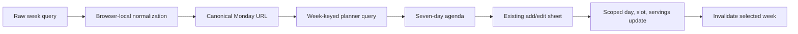

# Add week navigation and meal editing

## Why

The current-week agenda was useful, but a weekly planner also needs a stable way to revisit another week and correct a planned meal without removing and recreating it.

## What changed

- Added a canonical `week=YYYY-MM-DD` URL value for the Monday being viewed.
- Normalized missing, invalid, multi-value, and non-Monday requests against the browser's local calendar, avoiding UTC date drift.
- Added previous week, This week, and next week controls with refresh and browser-history stability across month and year boundaries.
- Reused the compact entry sheet for editing a meal's day within the viewed week, meal slot, and planned servings while keeping its recipe fixed.
- Scoped repository updates to an owner-visible entry and the selected weekly plan, then changed only the three editable planning fields.
- Kept existing archived-recipe entries visible, editable, removable, and Undo-safe without offering archived recipes as new choices.
- Preserved multiple different recipes in one slot and mapped an exact duplicate edit to focused, retryable feedback.
- Added route, date, repository, query, component, sheet, accessibility, and local browser coverage for navigation, editing, and reload persistence.
- Continued to follow `docs/assets/meal-planner-mockups.svg`; no calendar grid, drag-and-drop, cross-week move, global planner store, or new database change was introduced.

## Navigation and edit flow



## Files changed

Created:

- `docs/changelog/2026-08-21-0136-add-week-navigation-and-editing.md`

Modified:

- `README.md`
- `docs/ARCHITECTURE.md`
- `docs/project-plan.md`
- `src/app/meal-planner/__tests__/page.test.tsx`
- `src/app/meal-planner/page.tsx`
- `src/features/meal-planning/MealPlanEntrySheet.tsx`
- `src/features/meal-planning/MealPlanner.tsx`
- `src/features/meal-planning/__tests__/MealPlanEntrySheet.test.tsx`
- `src/features/meal-planning/__tests__/MealPlanner.test.tsx`
- `src/features/meal-planning/__tests__/meal-planning.dates.test.ts`
- `src/features/meal-planning/__tests__/meal-planning.queries.test.tsx`
- `src/features/meal-planning/__tests__/meal-planning.repository.test.ts`
- `src/features/meal-planning/meal-planning.dates.ts`
- `src/features/meal-planning/meal-planning.queries.ts`
- `src/features/meal-planning/meal-planning.repository.ts`
- `src/features/meal-planning/meal-planning.types.ts`
- `tests/e2e/meal-planner.spec.ts`

Deleted: none.

## Localized structure

```text
recipe-app/
├── docs/
│   ├── changelog/2026-08-21-0136-add-week-navigation-and-editing.md
│   ├── ARCHITECTURE.md
│   └── project-plan.md
├── src/
│   ├── app/meal-planner/
│   │   ├── __tests__/page.test.tsx
│   │   └── page.tsx
│   └── features/meal-planning/
│       ├── __tests__/
│       ├── MealPlanEntrySheet.tsx
│       ├── MealPlanner.tsx
│       ├── meal-planning.dates.ts
│       ├── meal-planning.queries.ts
│       ├── meal-planning.repository.ts
│       └── meal-planning.types.ts
├── tests/e2e/meal-planner.spec.ts
└── README.md
```

## Verification

- Focused route, date, repository, query, component, sheet, and accessibility tests.
- Full lint, typecheck, unit test suite, and production build.
- Local signed-in mobile and desktop browser journeys for URL normalization, adjacent-week navigation, editing, reload persistence, direct removal, and Undo.
