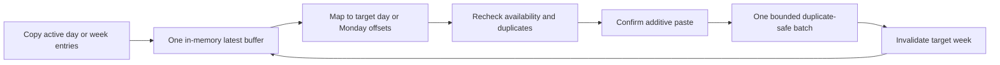

# Add planner copy and paste

## Why

Users needed a quick way to reuse a useful day or week without automatic recurrence, hidden future changes, or rebuilding the same schedule one meal at a time.

## What changed

- Added one latest-only day-or-week copy buffer owned by the mounted planner. It survives URL week navigation and clears naturally on reload or when the planner is left.
- Copied only active planned recipes while retaining recipe IDs, meal slots, planned servings, and either a target-independent day shape or Monday-relative week offsets.
- Added direct, 44-pixel Copy day, Paste day, Copy week, and Paste week actions following `docs/assets/meal-planner-mockups.svg`.
- Added a compact accessible preview dialog with eligible, exact-duplicate, archived, and deleted-or-unavailable counts plus loading, retry, error, and pending states.
- Rechecked owner-scoped recipe availability and current target entries during both preview and confirmation without revealing foreign recipe identities.
- Kept paste additive: existing entries remain untouched, exact duplicates are skipped, different recipes may share a slot, and eligible rows use one bounded duplicate-ignoring batch.
- Avoided creating a target plan when every candidate is duplicated or unavailable and counted a concurrent exact duplicate from the rows actually inserted.
- Kept the buffer after success or failure so it can be reused until replaced, reloaded, or left.
- Extracted the repeated day presentation into `MealPlanDay.tsx` while keeping copy/paste orchestration explicit in `MealPlanner.tsx`; no recurrence engine, clipboard permission, persistent store, RPC, or new migration was added.

## Copy and paste flow



## Files changed

Created:

- `docs/changelog/2026-08-21-0208-add-planner-copy-and-paste.md`
- `src/features/meal-planning/MealPlanDay.tsx`
- `src/features/meal-planning/MealPlanPasteDialog.tsx`
- `src/features/meal-planning/__tests__/MealPlanPasteDialog.test.tsx`
- `src/features/meal-planning/__tests__/meal-planning.copy.test.ts`
- `src/features/meal-planning/meal-planning.copy.ts`

Modified:

- `README.md`
- `docs/ARCHITECTURE.md`
- `docs/project-plan.md`
- `src/features/meal-planning/MealPlanner.tsx`
- `src/features/meal-planning/__tests__/MealPlanner.test.tsx`
- `src/features/meal-planning/__tests__/meal-planning.queries.test.tsx`
- `src/features/meal-planning/__tests__/meal-planning.repository.test.ts`
- `src/features/meal-planning/meal-planning.constants.ts`
- `src/features/meal-planning/meal-planning.queries.ts`
- `src/features/meal-planning/meal-planning.repository.ts`
- `tests/e2e/meal-planner.spec.ts`

Deleted: none.

## Localized structure

```text
recipe-app/
├── docs/
│   ├── changelog/2026-08-21-0208-add-planner-copy-and-paste.md
│   ├── ARCHITECTURE.md
│   └── project-plan.md
├── src/features/meal-planning/
│   ├── __tests__/
│   │   ├── MealPlanner.test.tsx
│   │   ├── MealPlanPasteDialog.test.tsx
│   │   ├── meal-planning.copy.test.ts
│   │   ├── meal-planning.queries.test.tsx
│   │   └── meal-planning.repository.test.ts
│   ├── MealPlanDay.tsx
│   ├── MealPlanPasteDialog.tsx
│   ├── MealPlanner.tsx
│   ├── meal-planning.constants.ts
│   ├── meal-planning.copy.ts
│   ├── meal-planning.queries.ts
│   └── meal-planning.repository.ts
├── tests/e2e/meal-planner.spec.ts
└── README.md
```

## Verification

- Focused pure mapping, repository, query, planner, dialog, and accessibility tests.
- Full lint, typecheck, unit test suite, and production build.
- Local signed-in mobile and desktop browser journey for day copy/paste, week copy/paste, duplicate skipping, buffer reuse, and reload clearing.
