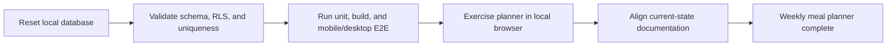

# Complete meal-planner acceptance

## Why

The weekly meal planner needed a final local acceptance pass to prove its database boundaries, signed-in workflow, responsive layout, persistence, and documentation before the feature could be marked complete.

## What changed

- Marked all weekly meal-planning slices complete in the project roadmap.
- Updated the architecture overview so it describes the meal planner as a completed feature rather than work awaiting acceptance.
- Clarified that the isolated local E2E command covers the full planner journey.
- Verified that the committed migration chain resets cleanly, database lint passes, and the planner SQL assertions pass against local Supabase.
- Verified the full unit/integration suite, production build, signed-out browser suite, and isolated signed-in mobile and desktop browser suite.
- Performed a hands-on local browser pass at mobile and desktop sizes using only local Supabase data. The pass covered two different recipes in one meal slot, remove/Undo, moving and resizing an entry, day copy/paste, week copy/paste, exact-duplicate skipping, reload persistence, buffer clearing, focus restoration, and horizontal overflow.

## Acceptance flow



## Files changed

Created:

- `docs/changelog/2026-08-21-0218-complete-meal-planner-acceptance.md`

Modified:

- `README.md`
- `docs/ARCHITECTURE.md`
- `docs/project-plan.md`

Deleted: none from the tracked project. The completed ignored working plan at `temp/05-weekly-meal-planner.md` was removed after acceptance.

## Localized structure

```text
recipe-app/
├── docs/
│   ├── changelog/
│   │   └── 2026-08-21-0218-complete-meal-planner-acceptance.md
│   ├── ARCHITECTURE.md
│   └── project-plan.md
└── README.md
```

## Verification

- `npx supabase db reset --local`
- `npx supabase db lint --local`
- Planner SQL assertions executed with fail-fast `psql` against local Supabase
- `npm run verify`
- `npm run build`
- `npm run test:e2e` with local public configuration: signed-out coverage passed and intentionally signed-in tests skipped
- `npm run test:e2e:local`: all signed-in mobile and desktop projects passed
- Hands-on mobile and desktop localhost acceptance against the isolated local database
