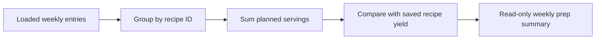

# Add weekly prep summary

## Why

A weekly plan showed individual meals but did not answer the practical preparation question: how many portions of each recipe are needed across the week? The summary needed to distinguish planned portions from a recipe's saved yield without introducing batch inventory or grocery-list behavior.

## What changed

- Added a pure planner-local summary that groups entries by recipe ID, sums planned servings across days and meal types, keeps sorted contributing dates, and includes archived planned recipes.
- Sorted summary rows by first planned date, title, and recipe ID for stable week-oriented output without mutating the loaded query data.
- Added one exact scale formatter: terminating ratios use trimmed decimals and repeating ratios use reduced fractions instead of rounded approximations.
- Added a direct Prep summary action for non-empty weeks, including archived-only plans, while leaving empty/loading/error states and all existing week actions unchanged.
- Added a compact read-only dialog following `docs/assets/meal-planner-mockups.svg`, with grouped totals, days, saved yield, exact scale, archived context, focus containment, Escape/backdrop close, trigger focus return, and bounded mobile scrolling.
- Derived the summary only from the already-loaded week DTO. No query, repository, mutation, RPC, migration, persistent state, automatic batch rounding, or ingredient scaling was added.

## Prep summary flow



## Files changed

Created:

- `docs/changelog/2026-08-21-1252-add-weekly-prep-summary.md`
- `src/features/meal-planning/MealPlanPrepDialog.tsx`
- `src/features/meal-planning/__tests__/MealPlanPrepDialog.test.tsx`
- `src/features/meal-planning/__tests__/meal-planning.prep.test.ts`
- `src/features/meal-planning/meal-planning.prep.ts`

Modified:

- `README.md`
- `docs/ARCHITECTURE.md`
- `docs/project-plan.md`
- `src/features/meal-planning/MealPlanner.tsx`
- `src/features/meal-planning/__tests__/MealPlanner.test.tsx`

Deleted: none.

## Localized structure

```text
recipe-app/
├── docs/
│   ├── changelog/2026-08-21-1252-add-weekly-prep-summary.md
│   ├── ARCHITECTURE.md
│   └── project-plan.md
├── src/features/meal-planning/
│   ├── __tests__/
│   │   ├── MealPlanPrepDialog.test.tsx
│   │   ├── MealPlanner.test.tsx
│   │   └── meal-planning.prep.test.ts
│   ├── MealPlanPrepDialog.tsx
│   ├── MealPlanner.tsx
│   └── meal-planning.prep.ts
└── README.md
```

## Verification

- Focused pure aggregation, scale-formatting, dialog, planner, and accessibility tests.
- Full meal-planning test suite.
- TypeScript, focused ESLint, and diff validation.
