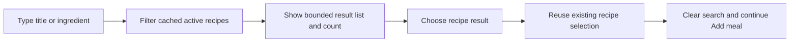

# Show meal-planner recipe search results

## Why

The Add meal sheet filtered its native Recipe select when a user searched by title or ingredient, but the closed select hid those matches. The search appeared to return nothing even though the existing local filtering worked.

## What changed

- Show active recipe matches immediately below a non-blank title-or-ingredient search.
- Keep the result panel height-bounded and internally scrollable so a long match list does not expand the sheet indefinitely.
- Announce the match count, expose each recipe as a touch-sized result button, and retain the existing native Recipe select for browsing without search.
- Reuse the existing recipe-selection path so choosing a result clears the search, preserves one-serving defaults, applies the existing meal suggestion, and returns focus to the selected Recipe field.
- Extend the existing signed-in meal-planner browser journey to select its one created recipe through a visible ingredient-search result.
- Update current feature and architecture documentation without changing the planner's data model, queries, or unrelated interactions.

## Files

Modified:

- `README.md`
- `docs/ARCHITECTURE.md`
- `docs/project-plan.md`
- `src/features/meal-planning/MealPlanEntrySheet.tsx`
- `src/features/meal-planning/__tests__/MealPlanEntrySheet.test.tsx`
- `tests/e2e/meal-planner.spec.ts`

Created:

- `docs/changelog/2026-08-21-1650-show-planner-recipe-search-results.md`

## Localized structure

```text
.
├── README.md
├── docs
│   ├── ARCHITECTURE.md
│   ├── changelog
│   │   └── 2026-08-21-1650-show-planner-recipe-search-results.md
│   └── project-plan.md
├── src
│   └── features
│       └── meal-planning
│           ├── MealPlanEntrySheet.tsx
│           └── __tests__
│               └── MealPlanEntrySheet.test.tsx
└── tests
    └── e2e
        └── meal-planner.spec.ts
```

## Interaction flow



## Verification

- `npm run typecheck` passed.
- `npm exec eslint -- src/features/meal-planning/MealPlanEntrySheet.tsx src/features/meal-planning/__tests__/MealPlanEntrySheet.test.tsx tests/e2e/meal-planner.spec.ts` passed.
- `npm test -- src/features/meal-planning/__tests__/MealPlanEntrySheet.test.tsx src/features/meal-planning/__tests__/meal-planning.queries.test.tsx` passed all 21 focused tests.
- `npm run verify` passed all 29 test files and 214 tests, plus full lint and TypeScript checks.
- `npm run build` completed successfully.
- `npm run test:e2e:local` passed all 12 desktop and mobile browser tests.
- `git diff --check` passed.

No database migration, dependency, environment, or setup change is required.
