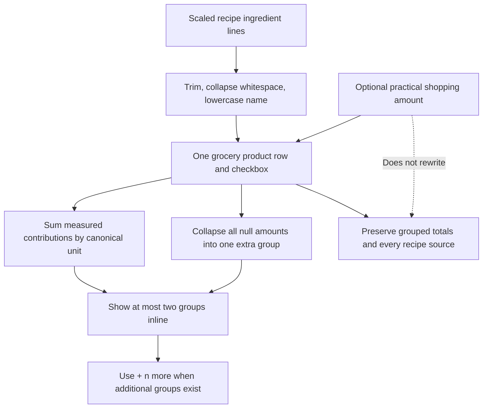

# Document the approved grouped grocery-list UI

## Why

The initial grocery-list plan treated ambiguous or differently measured recipe lines as separate checklist items. That preserved arithmetic but would duplicate products such as Pepper and make a shopping list harder to scan. The approved direction instead gives every normalized ingredient name one product row and one checkbox, while retaining its complete recipe requirements underneath.

## What changed

- Added a tracked three-phone grocery-list reference covering the list library, compact grouped checklist, and an expanded ten-recipe Pepper example.
- Recorded the approved compact-summary behavior: sum same-unit contributions, retain different units as requirement groups, collapse null amounts into one `extra` group, show at most two groups inline, and use `+ n more` for overflow.
- Preserved the complete grouped totals and recipe-by-recipe source details in the expanded state.
- Updated the local `temp/06-grocery-lists.md` implementation handoff with the approved name-first grouping algorithm, normalized-name uniqueness, shopping-amount override semantics, data-model implications, and revised acceptance tests.
- Added the asset to the README and project-plan visual-reference indexes without claiming that grocery lists are implemented.
- Retained the established flat `docs/assets` layout. Five focused visual files do not justify moving stable references into subdirectories and rewriting their consumers.

No application code, current architecture, database schema, migration, generated type, dependency, environment, or setup behavior changed. `docs/ARCHITECTURE.md`, the DBML source, and the ERD therefore remain unchanged.

## Files

Created:

- `docs/assets/grocery-list-mockups.svg`
- `docs/changelog/2026-08-21-2149-document-grouped-grocery-list-ui.md`

Modified:

- `README.md`
- `docs/project-plan.md`
- `temp/06-grocery-lists.md` (local ignored implementation handoff)

Deleted: none.

## Localized structure

```text
recipe-app/
├── README.md
├── docs/
│   ├── assets/
│   │   └── grocery-list-mockups.svg
│   ├── changelog/
│   │   └── 2026-08-21-2149-document-grouped-grocery-list-ui.md
│   └── project-plan.md
└── temp/
    └── 06-grocery-lists.md
```

## Approved grouping flow



## Verification

- `xmllint --noout docs/assets/grocery-list-mockups.svg` passed.
- The SVG rendered successfully to a 1250 × 1040 PNG and all three mobile frames were inspected without clipping or overlap.
- The compact Pepper row shows two groups plus `3 more`; the expanded state accounts for all ten recipes through four measured unit groups and one `Extra` group.
- A stale-rule scan found no remaining strict line-based or null-amount duplication instructions in the ignored implementation plan.
- The ignored plan, README index, project-plan reference, tracked SVG, and this changelog describe the same grouping and null-amount behavior.
- `git diff --check` passed for the tracked documentation changes.
