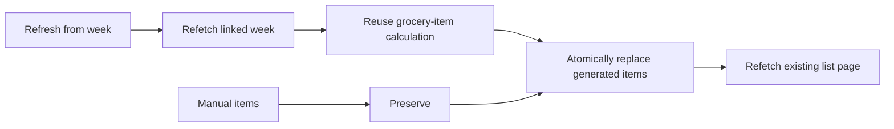

# Plan simple grocery-list week refresh

## Why

A grocery list generated from a meal-plan week needs one straightforward way to refetch that week and recalculate its generated items. A separate update page, preview workflow, or synchronization system would add unnecessary product and implementation complexity.

## What changed

- Added a simple **Refresh from week** button to the existing week-generated grocery-list detail mockup.
- Removed the separate refresh preview screens and the unrelated `Household top-up` example.
- Clarified that refresh refetches the linked week, reuses the existing ingredient generator, and atomically replaces the generated portion of the list.
- Kept manual additions, matching checked states, and matching practical shopping overrides; new generated rows are unchecked and obsolete generated rows are removed.
- Clarified that manual and selected-recipe lists have no refresh button and require no meal-plan week.
- Removed the proposed refresh page/sheet, diff model, stable generation keys, version fingerprints, refresh history, and separate refresh implementation slice.

No application code, current architecture, database schema, migration, generated type, dependency, environment, or setup behavior changed.

## Files

Created:

- `docs/changelog/2026-08-21-2208-plan-simple-grocery-week-refresh.md`

Modified:

- `README.md`
- `docs/assets/grocery-list-mockups.svg`
- `docs/project-plan.md`
- `temp/06-grocery-lists.md` (local ignored implementation handoff)

Deleted: none.

## Localized structure

```text
recipe-app/
├── README.md
├── docs/
│   ├── assets/
│   │   └── grocery-list-mockups.svg
│   ├── changelog/
│   │   └── 2026-08-21-2208-plan-simple-grocery-week-refresh.md
│   └── project-plan.md
└── temp/
    └── 06-grocery-lists.md
```

## Refresh flow



## Verification

- `xmllint --noout docs/assets/grocery-list-mockups.svg` passed.
- The SVG rendered successfully at 1250 × 1040 and all three screens were inspected without clipping or overlap.
- The mockup contains no separate refresh page and no `Household top-up` example.
- A terminology scan found no remaining refresh-preview, refresh-diff, version-fingerprint, generation-key, refresh-sheet, or separate refresh-slice requirements in the implementation handoff.
- `git diff --check` passed.
