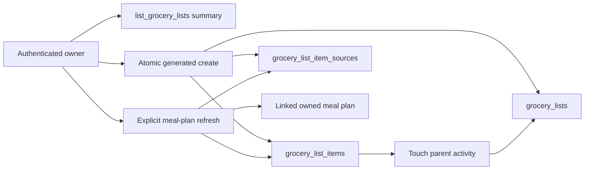

# Add Grocery-List Data Foundation

## Why

The approved grocery-list feature needs a private, durable snapshot model before application routes can safely create or refresh lists. The placeholder schema supported only one recipe reference per item, did not distinguish manual and generated lists, allowed duplicate product names after capitalization or whitespace changes, and could not atomically replace the generated portion of a meal-plan list.

This slice adds only the database foundation. Grocery-list routes, repositories, query hooks, and UI remain pending.

## What Changed

- Added one forward migration without rewriting the historical grocery tables.
- Added `manual`, `recipes`, and `meal_plan` list source types plus a durable meal-plan week label.
- Changed each grocery item into one checklist product with a stored normalized-name key, per-list uniqueness, notes, manual/generated ownership, and optional practical quantity overrides. One immutable SQL function collapses spaces, tabs, and newlines before trimming and lowercasing everywhere.
- Replaced the single recipe reference with `grocery_list_item_sources`, which preserves every recipe ingredient contribution and its original text after recipe or ingredient deletion.
- Backfilled compatible legacy grocery rows before removing `source_recipe_id`. The migration stops with a clear error if existing titles, items, or normalized duplicates cannot satisfy the new constraints.
- Added explicit authenticated table grants and owner-scoped RLS for lists, products, and source snapshots.
- Centralized parent-list activity updates after item mutations.
- Added a typed `list_grocery_lists()` summary function that returns counts without item bodies.
- Added bounded security-invoker functions for atomic generated-list creation and explicit meal-plan refresh. The database verifies source snapshots, every current ingredient exactly once, canonical unit buckets, six-decimal scaling arithmetic, every meal-plan recipe, and summed planned servings. Refresh locks the owned list row to serialize concurrent replacements, accepts an emptied week, preserves manual rows plus matching checked states and practical overrides, and replaces only current generated requirements.
- Added transactional SQL coverage for grants, owner isolation, normalized uniqueness, summary counts, generated snapshots, refresh behavior, atomic failure, and source/plan deletion semantics.
- Synchronized the checked-in Supabase TypeScript contract with the migrated local schema while preserving the repository generator's nullability and relationship metadata.
- Updated the current architecture and both database diagrams.
- Updated the repository index and Stage 3 checklist to distinguish the completed data foundation from the still-pending grocery-list application slices.

No background synchronization, refresh history, version fingerprints, persisted requirement groups, categories, pantry behavior, or grocery-list application UI was introduced.

## Files

Created:

- `supabase/migrations/20260821230000_add_grocery_list_foundation.sql`
- `supabase/tests/grocery_lists.sql`
- `docs/changelog/2026-08-21-2256-add-grocery-list-data-foundation.md`

Modified:

- `README.md`
- `docs/ARCHITECTURE.md`
- `docs/database-schema.dbml`
- `docs/database-erd.mmd`
- `docs/project-plan.md`
- `src/lib/supabase/database.types.ts`

No files were deleted.

## Localized Structure

```text
docs/
├── ARCHITECTURE.md
├── changelog/
│   └── 2026-08-21-2256-add-grocery-list-data-foundation.md
├── database-erd.mmd
├── database-schema.dbml
└── project-plan.md
README.md
src/
└── lib/
    └── supabase/
        └── database.types.ts
supabase/
├── migrations/
│   └── 20260821230000_add_grocery_list_foundation.sql
└── tests/
    └── grocery_lists.sql
```

## Data Flow



## Verification

- Inspected the local database before adding constraints: it contained zero grocery lists, zero grocery items, zero invalid rows, and zero duplicate normalized-name groups.
- `npx supabase db reset --local` applied the complete migration chain successfully.
- Reset to the pre-grocery migration, inserted representative legacy recipe-linked and meal-plan-linked rows, then forward-applied the migration. Source type/week metadata backfilled correctly; the legacy amount moved into its durable source contribution; and the product override fields were cleared.
- Repeated the pre-grocery upgrade with an invalid legacy recipe-linked amount and confirmed the migration stopped at the explicit compatibility preflight before attempting the constrained source backfill.
- `npx supabase db lint --local --level warning` reported no schema errors.
- `supabase/tests/grocery_lists.sql` passed against the reset local database, including refresh-lock definition inspection, tabs/newlines/whitespace-only names, exact ingredient coverage, duplicate ingredient rejection, canonical-unit validation, a unitless numeric source, summed meal-plan servings above 100, incorrect arithmetic rejection, empty-week refresh, atomic failure, and expanded two-user list/item/source RLS assertions.
- The Supabase CLI's two local connection modes remained blocked by its generator-container connection issue. The running local Postgres Meta endpoint was used to inspect the new table/function shapes, but its older output format narrowed nullable values and omitted current relationship metadata. The checked-in contract was therefore updated against that schema output while retaining the repository's current generator format; it includes all three grocery tables, the source enum, and the new functions.
