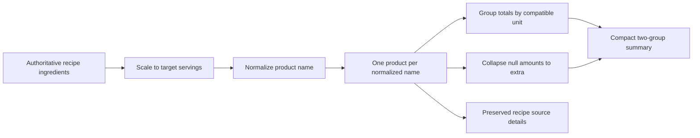

# Add Grocery Grouping Engine

## Why

Generated grocery lists need one deterministic calculation shared by selected recipes, meal-plan creation, and later week refresh. Keeping that calculation pure prevents preview and persistence from drifting and makes the approved same-name grouping behavior testable without a database or UI.

## What Changed

- Extracted the existing ingredient amount parser into a small shared ingredient module while preserving the recipe form's public import and parsing behavior.
- Added explicit grocery-list constants and DTO/generation types without exposing database rows to future React components.
- Added a pure generator that scales ingredient quantities to six decimals and keeps all source data immutable.
- Grouped names only by trim, collapsed whitespace, and lowercase comparison; no synonym, category, singularization, or fuzzy matching was introduced.
- Summed compatible unit contributions, kept incompatible units inside one product, collapsed unspecified amounts into one `extra` group, and omitted the quantity label when every source is unspecified.
- Added compact summaries with at most two visible groups plus `+ n more`, deterministic ordering, distinct-recipe counts, common fraction display, and practical shopping-override formatting.
- Kept selected-recipe limits out of the shared engine so meal-plan weeks can contain more than ten recipes and summed target servings above 100.
- Rejected non-finite, non-positive, round-to-zero, and precision-overflow quantities before they can render.

No routes, database calls, checklist screens, recipe picker, or refresh UI were added in this slice.

## Files

Created:

- `src/features/ingredients/ingredient-amount.ts`
- `src/features/ingredients/__tests__/ingredient-amount.test.ts`
- `src/features/grocery-lists/grocery-list.constants.ts`
- `src/features/grocery-lists/grocery-list.types.ts`
- `src/features/grocery-lists/grocery-list.generation.ts`
- `src/features/grocery-lists/__tests__/grocery-list.generation.test.ts`
- `docs/changelog/2026-08-21-2343-add-grocery-grouping-engine.md`

Modified:

- `src/features/recipes/recipe.validation.ts`
- `docs/ARCHITECTURE.md`
- `docs/project-plan.md`

No files were deleted.

## Localized Structure

```text
docs/
├── ARCHITECTURE.md
├── changelog/
│   └── 2026-08-21-2343-add-grocery-grouping-engine.md
└── project-plan.md
src/
└── features/
    ├── grocery-lists/
    │   ├── __tests__/
    │   │   └── grocery-list.generation.test.ts
    │   ├── grocery-list.constants.ts
    │   ├── grocery-list.generation.ts
    │   └── grocery-list.types.ts
    ├── ingredients/
    │   ├── __tests__/
    │   │   └── ingredient-amount.test.ts
    │   └── ingredient-amount.ts
    └── recipes/
        └── recipe.validation.ts
```

## Calculation Flow



## Verification

- Focused parser, grocery generation, and recipe validation tests passed: 69 tests.
- The complete Vitest suite passed: 270 tests across 31 files.
- TypeScript type checking passed.
- ESLint passed.
- `git diff --check` passed.
- Two independent review passes found and fixed the meal-plan limit leakage and the round-to-zero/overflow formatter boundary.
