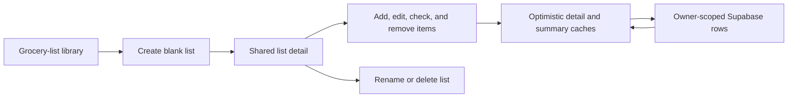

# Add standalone manual grocery lists

**Date:** 2026-08-22 00:08 +08

## Why

The grocery-list schema and ingredient-grouping engine were already private and tested, but users still had no application screen for an ordinary shopping checklist. This slice adds the smallest useful standalone flow before recipe selection and meal-plan refresh are connected.

## What changed

- Added authenticated grocery-list library, blank creation, and detail routes with immediate loading states.
- Added owner-scoped repository, mapping, validation, safe-error, TanStack Query, and cache-key boundaries for manual list and item operations.
- Added library cards with source, progress, and activity summaries, plus the approved blank-list and recipe-generation entry points.
- Added one shared checklist detail with optional manual quantities and notes, immediate optimistic checking, a collapsed Completed section, add/edit/remove sheet, rename dialog, and deliberate deletion.
- Kept refresh source-specific: manual lists never display **Refresh from week**.
- Added Grocery lists to the existing More sheet without changing the three-slot bottom navigation.
- Reused the pure grocery requirement grouping rule when mapping stored source snapshots.
- Rejected manual quantities that cannot be represented safely at six-decimal grocery precision, and treated malformed list identifiers as unavailable without querying the database.
- Added focused route, UI, validation, mapper, repository, query, error, and navigation tests.
- Added a signed-in local Playwright journey covering create, add, edit, check, reload, uncheck, rename, library progress, persistence, and delete on mobile and desktop.

## Flow



## Files changed

- `README.md`
- `docs/ARCHITECTURE.md`
- `docs/project-plan.md`
- `docs/changelog/2026-08-22-0008-add-manual-grocery-lists.md`
- `src/app/grocery-lists/page.tsx`
- `src/app/grocery-lists/loading.tsx`
- `src/app/grocery-lists/__tests__/page.test.tsx`
- `src/app/grocery-lists/new/page.tsx`
- `src/app/grocery-lists/new/loading.tsx`
- `src/app/grocery-lists/new/__tests__/page.test.tsx`
- `src/app/grocery-lists/[id]/page.tsx`
- `src/app/grocery-lists/[id]/loading.tsx`
- `src/app/grocery-lists/[id]/__tests__/page.test.tsx`
- `src/features/grocery-lists/DeleteGroceryListDialog.tsx`
- `src/features/grocery-lists/GroceryListCard.tsx`
- `src/features/grocery-lists/GroceryListDetail.tsx`
- `src/features/grocery-lists/GroceryListItemRow.tsx`
- `src/features/grocery-lists/GroceryListItemSheet.tsx`
- `src/features/grocery-lists/GroceryListLibrary.tsx`
- `src/features/grocery-lists/grocery-list-skeletons.tsx`
- `src/features/grocery-lists/grocery-list.errors.ts`
- `src/features/grocery-lists/grocery-list.generation.ts`
- `src/features/grocery-lists/grocery-list.mappers.ts`
- `src/features/grocery-lists/grocery-list.queries.ts`
- `src/features/grocery-lists/grocery-list.repository.ts`
- `src/features/grocery-lists/grocery-list.types.ts`
- `src/features/grocery-lists/grocery-list.validation.ts`
- `src/features/grocery-lists/__tests__/GroceryListDetail.test.tsx`
- `src/features/grocery-lists/__tests__/GroceryListItemSheet.test.tsx`
- `src/features/grocery-lists/__tests__/GroceryListLibrary.test.tsx`
- `src/features/grocery-lists/__tests__/grocery-list.errors.test.ts`
- `src/features/grocery-lists/__tests__/grocery-list.generation.test.ts`
- `src/features/grocery-lists/__tests__/grocery-list.mappers.test.ts`
- `src/features/grocery-lists/__tests__/grocery-list.queries.test.tsx`
- `src/features/grocery-lists/__tests__/grocery-list.repository.test.ts`
- `src/features/grocery-lists/__tests__/grocery-list.validation.test.ts`
- `src/features/recipes/RecipeNavigation.tsx`
- `src/features/recipes/__tests__/recipe-navigation.test.tsx`
- `src/lib/query/query-keys.ts`
- `tests/e2e/grocery-lists.spec.ts`

## Localized structure

```text
src/
├── app/grocery-lists/
│   ├── [id]/
│   ├── new/
│   └── page.tsx
├── features/grocery-lists/
│   ├── GroceryListLibrary.tsx
│   ├── GroceryListDetail.tsx
│   ├── GroceryListItemSheet.tsx
│   ├── grocery-list.repository.ts
│   ├── grocery-list.queries.ts
│   └── __tests__/
└── lib/query/query-keys.ts
tests/
└── e2e/grocery-lists.spec.ts
```

## Verification

- `npm run verify`
- `npm run build`
- Focused local Supabase Playwright acceptance: 2 projects passed (mobile and desktop)
- Full local Playwright run: 12 existing tests passed before the focused grocery-list rerun
- `git diff --check`
