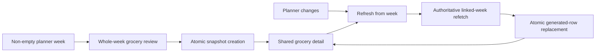

# Generate And Refresh Week Grocery Lists

## What changed

- Added a **Grocery list** action to loaded non-empty planner weeks. It opens the existing grocery creation route with the normalized Monday date rather than introducing another page.
- Added a one-page week generator that shows the compact week range, every planned recipe, saved and summed planned servings, the existing exact scale label, archived status, and the shared grouped-item review.
- Reused the planner preparation aggregator so repeated entries for one recipe are summed consistently across planner and grocery views.
- Refetched the authoritative owned week for review and again before atomic creation. Week generation includes archived planned recipes but does not mutate or invalidate the planner.
- Added the approved detail-page **Refresh from week** button only for an available linked meal-plan list. Refresh accepts only the grocery-list ID, resolves its linked plan, and reuses the same generation path before calling the existing atomic replacement function.
- Kept Refresh and Add item together on the existing detail screen. A successful refresh reports the compact source week; a failed refresh leaves the snapshot editable and retryable. Detached weeks retain their saved label and checklist but show no refresh control.
- Consolidated compact grocery week labels into one formatter used by generator, library card, detail header, and refresh feedback.
- Extended mobile and desktop acceptance through snapshot creation, planner changes, unchanged pre-refresh state, and recalculation that preserves manual items plus matching checkbox and practical-amount state while adding/removing generated products.

## Why

This completes the approved simple refresh model: week-generated lists are durable snapshots, and the user explicitly recalculates one from its original linked week with a single button. There is no separate refresh page, confirmation, diff, preview, history, or background synchronization.



## Files changed

```text
.
├── README.md
├── docs/
│   ├── ARCHITECTURE.md
│   ├── project-plan.md
│   └── changelog/
│       └── 2026-08-22-0202-generate-and-refresh-week-grocery-lists.md
├── src/
│   ├── app/grocery-lists/new/
│   │   ├── page.tsx
│   │   └── __tests__/page.test.tsx
│   ├── features/
│   │   ├── grocery-lists/
│   │   │   ├── GroceryListCard.tsx
│   │   │   ├── GroceryListDetail.tsx
│   │   │   ├── GroceryListLibrary.tsx
│   │   │   ├── MealPlanGroceryListGenerator.tsx
│   │   │   ├── grocery-list.errors.ts
│   │   │   ├── grocery-list.mappers.ts
│   │   │   ├── grocery-list.queries.ts
│   │   │   ├── grocery-list.repository.ts
│   │   │   ├── grocery-list.types.ts
│   │   │   ├── grocery-list.validation.ts
│   │   │   ├── grocery-list.week-formatting.ts
│   │   │   └── __tests__/
│   │   │       ├── GroceryListDetail.test.tsx
│   │   │       ├── MealPlanGroceryListGenerator.test.tsx
│   │   │       ├── grocery-list.errors.test.ts
│   │   │       ├── grocery-list.mappers.test.ts
│   │   │       ├── grocery-list.queries.test.tsx
│   │   │       ├── grocery-list.repository.test.ts
│   │   │       ├── grocery-list.validation.test.ts
│   │   │       └── grocery-list.week-formatting.test.ts
│   │   └── meal-planning/
│   │       ├── MealPlanner.tsx
│   │       └── __tests__/MealPlanner.test.tsx
│   └── lib/query/query-keys.ts
└── tests/e2e/grocery-lists.spec.ts
```

## Verification

- ESLint passed.
- TypeScript typecheck passed.
- Vitest passed with 46 files and 402 tests.
- The complete local Playwright suite passed 18/18 across the mobile Safari-size and desktop Chrome projects.
- The existing grocery SQL suite remains the database acceptance boundary for atomic refresh ownership, rollback, checked/override/manual preservation, and generated row replacement; no migration was needed in this slice.
