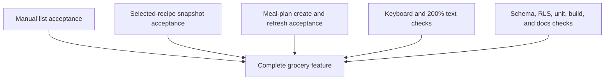

# Complete Grocery List Acceptance

## What changed

- Extended the real signed-in meal-plan grocery journey with keyboard-only opening, initial focus, Tab movement, Escape closing, and focus restoration for the item sheet.
- Exercised the completed linked-list screen at 200% text scale on the mobile and desktop projects and asserted that visible application content does not overflow horizontally.
- Re-ran the complete local migration chain, schema lint, two-user/adversarial grocery SQL suite, application verification, production build, and all local browser projects.
- Marked every grocery-list implementation and acceptance slice complete in current documentation.
- Removed the temporary `06-grocery-lists.md` implementation plan now that its approved behavior is implemented, verified, documented, reviewed, and committed in coherent slices.

## Why

This closes the feature against its original acceptance bar rather than treating the primary happy path as sufficient. Grocery lists now have verified manual, selected-recipe, and meal-plan workflows on mobile and desktop, including the approved simple in-place week refresh.



## Files changed

```text
.
├── README.md
├── docs/
│   ├── ARCHITECTURE.md
│   ├── project-plan.md
│   └── changelog/
│       └── 2026-08-22-0213-complete-grocery-list-acceptance.md
├── temp/
│   └── 06-grocery-lists.md (deleted)
└── tests/e2e/grocery-lists.spec.ts
```

## Verification

- Full local Supabase reset passed through every migration.
- Supabase schema lint passed with no errors.
- The grocery SQL suite passed, including authenticated/anonymous permissions, two-user isolation, atomic creation/refresh, rollback, and preservation rules.
- ESLint, TypeScript, Vitest, and the production build passed.
- Playwright passed 18/18 across the mobile Safari-size and desktop Chrome projects after adding keyboard and 200% text-scale acceptance.
- Current README, architecture, project plan, DBML, ERD, approved mockup, and changelogs were checked for feature-state consistency.

The local Supabase type generator still fails inside its generator container with PostgreSQL password authentication. The tracked types remain the manually synchronized contract already verified against the live local schema, repository compilation, and the reset/lint/SQL suites; no generator output was written over the tracked file.
