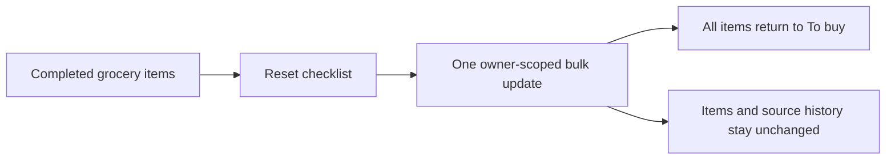

# Reset Grocery Checklists For Reuse

## What changed

- Added **Reset checklist** to the existing grocery-list actions popover whenever at least one item is completed.
- Reset every checked item to unchecked with one owner-scoped bulk update while preserving item names, quantities, notes, ordering, practical overrides, recipe-source history, and list source type.
- Kept the action lightweight: it has no new route or confirmation dialog, prevents competing checkbox changes while pending, reports success accessibly, and leaves the list unchanged with a safe inline error when the request fails.
- Refreshed only the grocery-list library summary and the affected detail cache after success.
- Extended repository, query, component, and signed-in browser coverage for reset scope, visibility, success, failure, persistence, and cache invalidation.

## Why

A completed grocery list is often useful again when a meal roster repeats. Resetting the checked state lets the same durable manual, selected-recipe, or meal-plan snapshot become a fresh shopping checklist without rebuilding or duplicating it.



## Files changed

```text
.
├── README.md
├── docs/
│   ├── ARCHITECTURE.md
│   ├── project-plan.md
│   └── changelog/
│       └── 2026-08-22-0236-reset-grocery-checklist.md
├── src/features/grocery-lists/
│   ├── GroceryListDetail.tsx
│   ├── grocery-list.queries.ts
│   ├── grocery-list.repository.ts
│   ├── grocery-list.types.ts
│   └── __tests__/
│       ├── GroceryListDetail.test.tsx
│       ├── grocery-list.queries.test.tsx
│       └── grocery-list.repository.test.ts
└── tests/e2e/grocery-lists.spec.ts
```

## Verification

- TypeScript typecheck passed.
- ESLint passed.
- Focused grocery repository, query, and detail tests passed with 62 tests.
- The full unit/component suite passed with 46 files and 407 tests.
- The optimized production build passed.
- Local signed-in Playwright acceptance passed 18/18 across the mobile Safari-size and desktop Chrome projects, including reset persistence through the real Supabase and RLS path.
