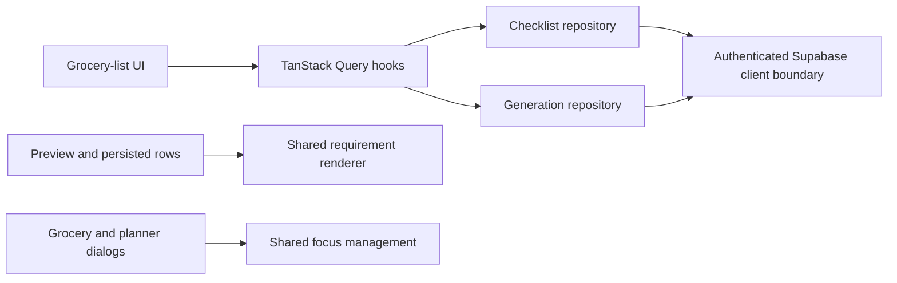

# Simplify grocery-list code without changing behavior

## Why

The completed grocery-list feature had accumulated repeated recipe-requirement markup, repeated dialog focus effects, four copies of title-form validation, and one repository that mixed ordinary checklist CRUD with generated recipe and meal-plan workflows. This maintainability pass consolidates those stable rules and separates responsibilities while preserving the approved UI, copy, routes, database contract, and user behavior.

## What changed

- Added one shared recipe-requirement renderer and moved source amount/count wording into the existing grocery formatting module. Generated previews and persisted rows retain their previous classes, labels, capitalization, expanded source lines, and disclosure behavior.
- Added one shared dialog focus-management hook for initial focus, Escape, Tab trapping, and safe focus return. Grocery item, rename, delete, meal-entry, paste, and prep dialogs retain their existing visible structure and pending-state rules.
- Extracted the rename dialog from the grocery detail screen without changing its form or actions.
- Reused one grocery-title schema and form-validation adapter across blank creation, rename, selected-recipe generation, and meal-plan generation. Existing visible validation messages remain unchanged.
- Split library/detail/checklist persistence from recipe/meal-plan generation persistence. Both repository modules reuse the same authenticated Supabase client boundary.
- Removed detail-only DTO fields that were selected and mapped but never consumed by application code.
- Renamed the repository test module to cover both repository responsibilities and updated focused fixtures/imports.
- Updated the README file index, current architecture, and project progress documentation so they describe the same simplified implementation boundaries.

## Structure

```text
README.md                                  # current repository entry point
src/
├── components/ui/
│   └── useDialogFocusManagement.ts       # shared dialog behavior
└── features/
    ├── grocery-lists/
    │   ├── GroceryListRequirementDetails.tsx
    │   ├── RenameGroceryListDialog.tsx
    │   ├── grocery-list.repository.ts    # library, detail, checklist CRUD
    │   ├── grocery-list-generation.repository.ts
    │   ├── grocery-list.repository-client.ts
    │   ├── grocery-list.requirement-formatting.ts
    │   └── __tests__/
    │       └── grocery-list.repositories.test.ts
    └── meal-planning/
        ├── MealPlanEntrySheet.tsx
        ├── MealPlanPasteDialog.tsx
        └── MealPlanPrepDialog.tsx
```



## Files

Created:

- `docs/changelog/2026-08-22-0307-simplify-grocery-list-code.md`
- `src/components/ui/useDialogFocusManagement.ts`
- `src/features/grocery-lists/GroceryListRequirementDetails.tsx`
- `src/features/grocery-lists/RenameGroceryListDialog.tsx`
- `src/features/grocery-lists/grocery-list-generation.repository.ts`
- `src/features/grocery-lists/grocery-list.repository-client.ts`

Renamed:

- `src/features/grocery-lists/__tests__/grocery-list.repository.test.ts` to `src/features/grocery-lists/__tests__/grocery-list.repositories.test.ts`

Modified:

- `README.md`
- `docs/ARCHITECTURE.md`
- `docs/project-plan.md`
- `src/features/grocery-lists/DeleteGroceryListDialog.tsx`
- `src/features/grocery-lists/GroceryListDetail.tsx`
- `src/features/grocery-lists/GroceryListGenerator.tsx`
- `src/features/grocery-lists/GroceryListItemRow.tsx`
- `src/features/grocery-lists/GroceryListItemSheet.tsx`
- `src/features/grocery-lists/GroceryListLibrary.tsx`
- `src/features/grocery-lists/GroceryListSourceDisclosure.tsx`
- `src/features/grocery-lists/MealPlanGroceryListGenerator.tsx`
- `src/features/grocery-lists/__tests__/GroceryListDetail.test.tsx`
- `src/features/grocery-lists/__tests__/GroceryListItemRow.test.tsx`
- `src/features/grocery-lists/__tests__/GroceryListItemSheet.test.tsx`
- `src/features/grocery-lists/__tests__/grocery-list.generation.test.ts`
- `src/features/grocery-lists/__tests__/grocery-list.mappers.test.ts`
- `src/features/grocery-lists/__tests__/grocery-list.queries.test.tsx`
- `src/features/grocery-lists/__tests__/grocery-list.validation.test.ts`
- `src/features/grocery-lists/grocery-list.generation.ts`
- `src/features/grocery-lists/grocery-list.mappers.ts`
- `src/features/grocery-lists/grocery-list.queries.ts`
- `src/features/grocery-lists/grocery-list.repository.ts`
- `src/features/grocery-lists/grocery-list.requirement-formatting.ts`
- `src/features/grocery-lists/grocery-list.types.ts`
- `src/features/grocery-lists/grocery-list.validation.ts`
- `src/features/meal-planning/MealPlanEntrySheet.tsx`
- `src/features/meal-planning/MealPlanPasteDialog.tsx`
- `src/features/meal-planning/MealPlanPrepDialog.tsx`

Deleted:

- None. The singular repository test filename was renamed rather than removed.

## Verification

- `npm run verify` — ESLint, TypeScript, and 408 unit/component tests passed without warnings.
- `npm run build` — the Next.js production build completed successfully.
- `npx supabase db lint --local --level warning` — no schema errors found.
- `supabase/tests/grocery_lists.sql` — the transactional local grocery-list SQL suite passed.
- `npm run test:e2e:local` — all 18 mobile and desktop Playwright journeys passed, including standalone editing/reset, recipe generation, source disclosures, focus return, and meal-plan refresh preservation.
- `git diff --check` — passed.
