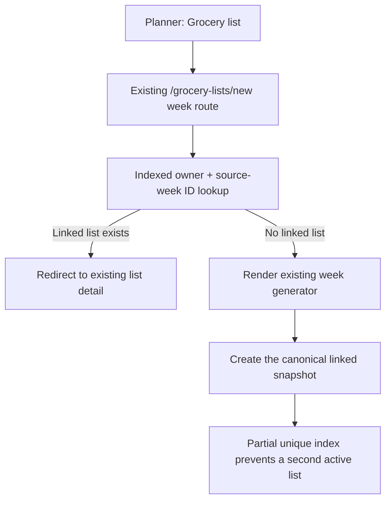

# Reopen the grocery list linked to a planned week

## Why

The meal planner's **Grocery list** action always opened the week generator, even when that week already had an active linked grocery list. Repeating the flow could create separate snapshots for the same owner and week. The generated default title also omitted the year, making older weekly lists less clear in the library.

## What changed

- Added a forward migration with a partial unique index over the existing owner and source-week columns. It permits only one active linked meal-plan grocery list per owner/week without adding a field. Manual, selected-recipe, and detached historical lists remain unaffected.
- Added a migration preflight that stops with a repair-oriented diagnostic if duplicate active owner/week groups ever exist instead of deleting or choosing data silently.
- Added one owner-scoped, ID-only repository lookup for the existing active list.
- Updated the existing authenticated meal-plan generator route to redirect to that list before rendering. A week without a linked list still uses the same generator and UI.
- Made concurrent creation recover cleanly: the unique index accepts one list, and only that specific conflict resolves to the canonical list ID for the other request.
- Changed only the automatic editable week-list title to include its year, such as `Groceries · 17–23 Aug 2026`. Compact source labels stay unchanged, users can still rename lists, and refresh never overwrites a custom title.
- Extended SQL, repository, route, formatter, component, and signed-in browser coverage for uniqueness, redirect behavior, and title formatting.
- Updated the README, architecture guide, database DBML, and project plan to describe the same current behavior.

## Flow



## Structure

```text
supabase/
├── migrations/
│   └── 20260822033256_enforce_one_linked_grocery_list_per_week.sql
└── tests/
    └── grocery_lists.sql
src/
├── app/grocery-lists/new/
│   ├── page.tsx
│   └── __tests__/page.test.tsx
└── features/grocery-lists/
    ├── MealPlanGroceryListGenerator.tsx
    ├── grocery-list-generation.repository.ts
    ├── grocery-list.week-formatting.ts
    └── __tests__/
tests/e2e/
└── grocery-lists.spec.ts
```

## Files

Created:

- `docs/changelog/2026-08-22-0337-reopen-week-grocery-list.md`
- `supabase/migrations/20260822033256_enforce_one_linked_grocery_list_per_week.sql`

Modified:

- `README.md`
- `docs/ARCHITECTURE.md`
- `docs/database-schema.dbml`
- `docs/project-plan.md`
- `src/app/grocery-lists/new/__tests__/page.test.tsx`
- `src/app/grocery-lists/new/page.tsx`
- `src/features/grocery-lists/MealPlanGroceryListGenerator.tsx`
- `src/features/grocery-lists/__tests__/MealPlanGroceryListGenerator.test.tsx`
- `src/features/grocery-lists/__tests__/grocery-list.repositories.test.ts`
- `src/features/grocery-lists/__tests__/grocery-list.week-formatting.test.ts`
- `src/features/grocery-lists/grocery-list-generation.repository.ts`
- `src/features/grocery-lists/grocery-list.week-formatting.ts`
- `supabase/tests/grocery_lists.sql`
- `tests/e2e/grocery-lists.spec.ts`

Deleted:

- None.

## Database and security notes

- The lookup selects only `grocery_lists.id`, explicitly filters the authenticated owner, and remains protected by the existing grocery-list RLS policy.
- The partial unique index is limited to `source_type = 'meal_plan'` rows whose `meal_plan_id` remains linked. Deleting a meal plan detaches its historical list through the existing `ON DELETE SET NULL` relationship and frees that owner/week for a future active list.
- The index changes no table columns, RLS policies, RPC signatures, or generated TypeScript database types.

## Verification

- Focused route, repository, formatter, and generator tests passed: 52 tests.
- `npm run verify` passed without warnings: ESLint, TypeScript, and 414 unit/component tests.
- `npm run build` completed the Next.js production build successfully.
- Full local database reset applied the new forward migration.
- Grocery-list transactional SQL suite passed.
- Local Supabase database lint reported no schema errors.
- Migration index definition and zero duplicate active owner/week groups were confirmed after reset.
- `npm run test:e2e:local` passed all 18 mobile and desktop journeys, including reopening the existing week-linked list and retaining refresh behavior.
- Independent review found no remaining correctness, migration, security, race, UI, or documentation issues after the concurrent-creation recovery was added.
- `git diff --check` passed.
