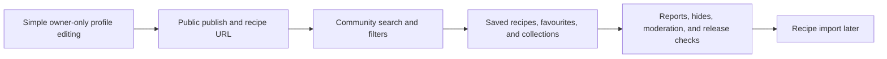

# Plan simple profiles and community sharing

## Why

The earlier future plans treated unlisted recipe links as a prerequisite and excluded saving from community discovery. Product decisions now require the opposite: a small editable author identity first, followed by public-only publishing and URL sharing, filterable discovery, bookmark-style saves, favourites, collections, and essential safety controls. Recipe copying remains outside this focused release.

## What changed

- Replaced the controlled/unlisted-sharing plan with a focused profile-editing prerequisite.
- Limited the profile feature to owner-only display name and unique username editing. Avatars, bios, public profiles, follows, feeds, and other social behavior remain out of scope.
- Replaced the short community outline with an implementation-ready plan covering public publishing, safe public projections, stable public recipe URLs, private-bucket image authorization, search and filters, saves/favourites/collections, deterministic unpublish/delete behavior, reports, hides, and minimal moderation.
- Recorded that saves are live bookmarks on a separate page, never copies or owned-library entries.
- Explicitly rejected unlisted links, share tokens, recipe copying/forking/remixing, and saved-community-recipe use in meal planning or grocery generation.
- Added tracked SVG references for the approved profile and community flows, following the app's existing cream, leaf-green, and slate theme.
- Simplified publishing to one direct confirmation without a publishing-rights checkbox.
- Reconciled the README, architecture guide, and project roadmap with the new delivery order and product boundaries.

## Delivery order



## Structure

```text
temp/
├── 08-simple-profile-editing.md
└── 09-community-sharing-and-discovery.md
docs/
├── ARCHITECTURE.md
├── assets/
│   ├── community-sharing-mockups.svg
│   └── profile-mockups.svg
├── project-plan.md
└── changelog/
    └── 2026-08-22-1239-plan-profiles-and-community-sharing.md
README.md
```

## Files

Created:

- `temp/08-simple-profile-editing.md` (local ignored implementation handoff)
- `temp/09-community-sharing-and-discovery.md` (local ignored implementation handoff)
- `docs/assets/profile-mockups.svg`
- `docs/assets/community-sharing-mockups.svg`
- `docs/changelog/2026-08-22-1239-plan-profiles-and-community-sharing.md`

Modified:

- `README.md`
- `docs/ARCHITECTURE.md`
- `docs/project-plan.md`

Deleted:

- `temp/08-controlled-recipe-sharing.md` (local ignored implementation handoff)
- `temp/09-community-discovery-and-moderation.md` (local ignored implementation handoff)

## Verification

- Confirmed the profile plan matches the existing `profiles` schema, signup trigger, owner-only RLS, private header fallback, and current absence of profile editing.
- Confirmed the community plan matches the existing recipe visibility/publishing fields, owner-only recipe reads, private image Storage, discovery filters, archive/delete flow, and dormant `shared` enum value.
- Searched current documentation for stale unlisted-sharing, copy/fork, saved-library, profile-order, and community-stage descriptions.
- Rendered and visually inspected both SVG references for theme consistency, legibility, clipping, and the direct publish confirmation.
- Verified Markdown structure, internal plan references, exact file inventory, and final diff formatting.
