# Add simple profile editing

## Why

Community publishing needs a stable author identity, but private recipe, planner, and grocery-list use should not require social-profile setup. This slice adds only the smallest useful owner-controlled identity: a display name and unique username. Avatars, biographies, public profile reads, profile pages, follows, and publishing remain outside the implementation.

## What changed

- Added an authenticated `/profile` route with an accessible loading state and a mobile editor that follows the approved cream, leaf-green, and slate reference.
- Added Profile as the first destination in the existing More sheet without changing the three-slot Home–Add–More bottom navigation.
- Added shared display-name and username normalization/validation, an explicit two-field DTO and mapper, safe error classification, an owner-scoped repository, and one TanStack Query cache key.
- Kept Auth user IDs inside the repository, selected and updated only `display_name,username`, and refreshed the server-rendered private header after a successful save.
- Added a forward migration that preflights incompatible legacy values, constrains both identity fields, rejects reserved usernames, enforces case-insensitive username uniqueness, narrows browser updates to two columns, and keeps the existing owner-only RLS boundary.
- Updated the Auth profile trigger to normalize valid provider display names and safely omit invalid metadata so new profile checks cannot break signup.
- Added focused unit, repository, query, component, route, navigation, SQL, and signed-in Playwright coverage, including a second-user duplicate username attempt.
- Reconciled current architecture, roadmap, schema, setup, and repository-entry documentation.

## Save flow

```mermaid
flowchart LR
    more["More sheet"] --> route["Authenticated /profile route"]
    route --> editor["Owner-only profile editor"]
    editor --> validate["Shared normalize and validate"]
    validate --> repository["Update display_name and username for auth user"]
    repository --> database["RLS, checks, and unique index"]
    database --> cache["Replace and invalidate profile.current"]
    cache --> refresh["Refresh server-rendered private header"]
```



## Structure

```text
src/
├── app/profile/
│   ├── __tests__/page.test.tsx
│   ├── loading.tsx
│   └── page.tsx
├── features/profile/
│   ├── __tests__/
│   ├── ProfileEditor.tsx
│   ├── profile-skeletons.tsx
│   ├── profile.errors.ts
│   ├── profile.mappers.ts
│   ├── profile.queries.ts
│   ├── profile.repository.ts
│   ├── profile.types.ts
│   └── profile.validation.ts
└── lib/query/query-keys.ts
supabase/
├── migrations/20260822134210_add_profile_editing_rules.sql
└── tests/profiles.sql
tests/e2e/profile.spec.ts
docs/
├── ARCHITECTURE.md
├── database-schema.dbml
├── project-plan.md
└── changelog/2026-08-22-1356-add-simple-profile-editing.md
README.md
```

## Files

Created:

- `src/app/profile/__tests__/page.test.tsx`
- `src/app/profile/loading.tsx`
- `src/app/profile/page.tsx`
- `src/features/profile/ProfileEditor.tsx`
- `src/features/profile/profile-skeletons.tsx`
- `src/features/profile/profile.errors.ts`
- `src/features/profile/profile.mappers.ts`
- `src/features/profile/profile.queries.ts`
- `src/features/profile/profile.repository.ts`
- `src/features/profile/profile.types.ts`
- `src/features/profile/profile.validation.ts`
- `src/features/profile/__tests__/ProfileEditor.test.tsx`
- `src/features/profile/__tests__/profile.errors.test.ts`
- `src/features/profile/__tests__/profile.mappers.test.ts`
- `src/features/profile/__tests__/profile.queries.test.tsx`
- `src/features/profile/__tests__/profile.repository.test.ts`
- `src/features/profile/__tests__/profile.validation.test.ts`
- `supabase/migrations/20260822134210_add_profile_editing_rules.sql`
- `supabase/tests/profiles.sql`
- `tests/e2e/profile.spec.ts`
- `docs/changelog/2026-08-22-1356-add-simple-profile-editing.md`

Modified:

- `README.md`
- `docs/ARCHITECTURE.md`
- `docs/database-schema.dbml`
- `docs/project-plan.md`
- `src/features/recipes/RecipeNavigation.tsx`
- `src/features/recipes/__tests__/recipe-navigation.test.tsx`
- `src/lib/query/query-keys.ts`

Deleted:

- None.

Generated database types were inspected rather than hand-edited because this migration changes no table, column, enum, relationship, or function-return shape. Local regeneration was attempted, but the installed CLI could not authenticate through its type-generation connection path.

## Verification

- `npm run verify`
- `npm run build`
- Forward application with `npx supabase migration up --local`
- Profile SQL suite through fail-fast local `psql`
- Focused signed-in profile Playwright acceptance on mobile Safari size and desktop Chrome
- `git diff --check`

The SQL suite proves incomplete profiles remain valid, owner updates succeed, other-owner reads and updates remain invisible, non-editor columns cannot be updated, invalid and reserved values fail, duplicate usernames fail, invalid Auth metadata cannot break profile creation, the case-insensitive partial index is present, and the upgrade preflight emits a repair-oriented diagnostic.
